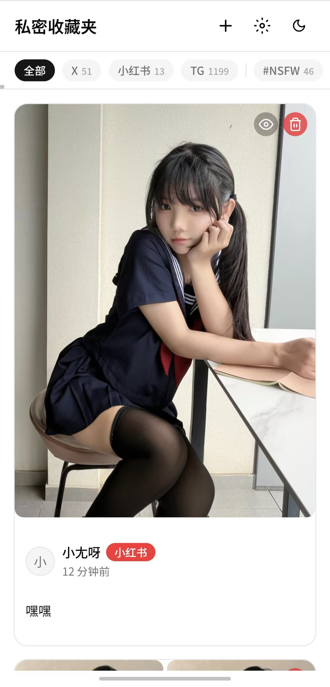
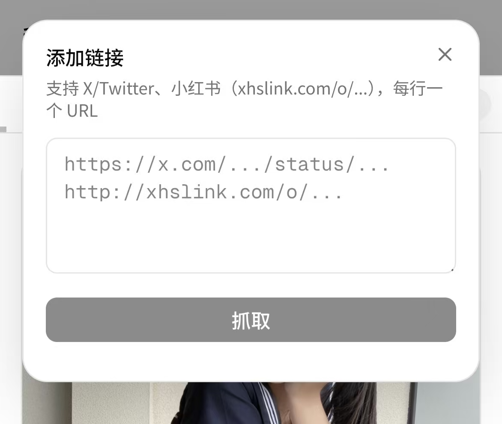
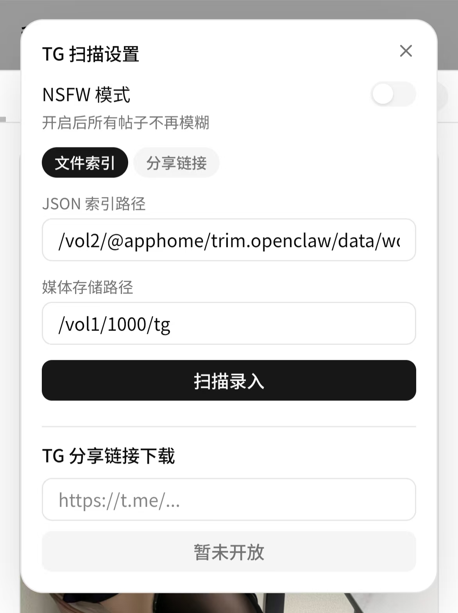

# 私密收藏夹

捕获和管理 X/Twitter、小红书、Telegram 收藏内容的私密收藏夹。无需任何第三方 API 配置，本地存储所有图片视频。






## 特色

- **三平台支持** — X/Twitter、小红书、Telegram（Saved Messages JSON 导入）
- **零 API 依赖** — 不需要任何官方 API key，前端贴链接即可抓取
- **自动下载** — 媒体异步下载到本地，SHA256 去重，失败自动重试
- **NSFW 模糊** — TG 来源默认模糊，逐帖切换可见，全局 NSFW 模式一键解锁
- **标签管理** — 平台标签（X / 小红书 / TG）+ 内容 hashtag 自动提取，后端维护点数
- **暗色主题** — 跟随系统或手动切换
- **移动适配** — 弹窗自适应底部弹出

## 功能

| 功能 | 说明 |
|------|------|
| 链接抓取 | 顶部 ➕ 按钮，支持 X/小红书 URL，多条换行批量抓取 |
| TG 导入 | 设置面板导入TG媒体库，生成卡片 |
| 瀑布流 | 响应式布局，无限滚动 |
| 标签过滤 | 顶部标签栏TAG过滤 |
| 模糊开关 | 每个卡片可切换模糊状态；可设置全局 NSFW 模式 |
| 大图预览 | 点击图片/视频全屏 |

## 媒体支持

| 平台 | 文本 | 图片 | 视频 |
|------|:----:|:----:|:----:|
| X/Twitter | ✅ | ✅ | 🚧  |
| 小红书 | ✅ | ✅ | 🚧 |
| Telegram（在线抓取） | 🚧 | 🚧 | 🚧 |
| Telegram（扫描） | ✅ | ✅ | ✅ |

## 启动

```bash
cp .env.example .env
docker compose up -d --build
```

前端 http://localhost:3000，后端 API http://localhost:8080

## 文档

- [开发环境与本地调试](docs/development.md)
- [生产部署](docs/deployment.md)
- [技术架构](docs/architecture.md)
- [TG 媒体导入](docs/tg-download-saved-media.md)
