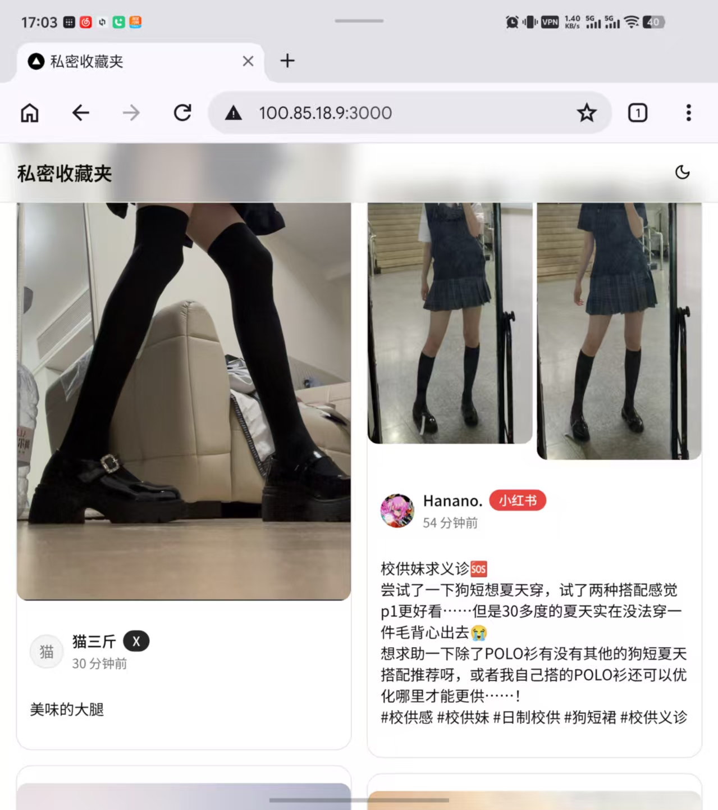
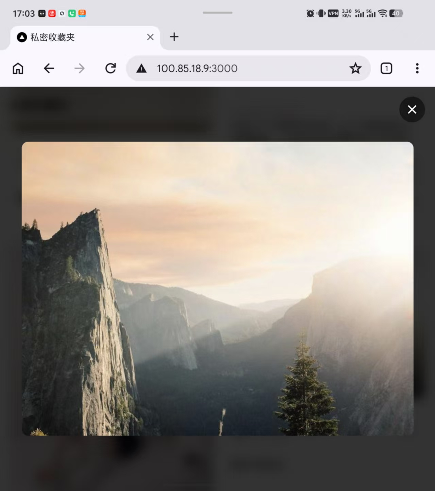
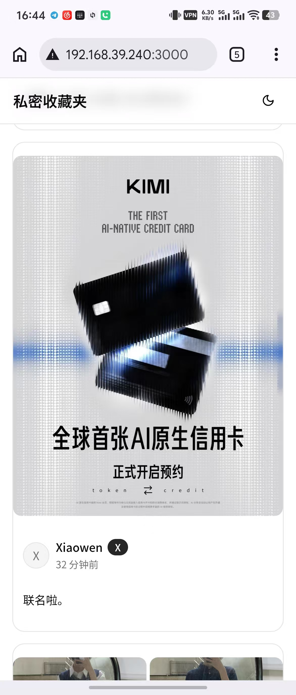
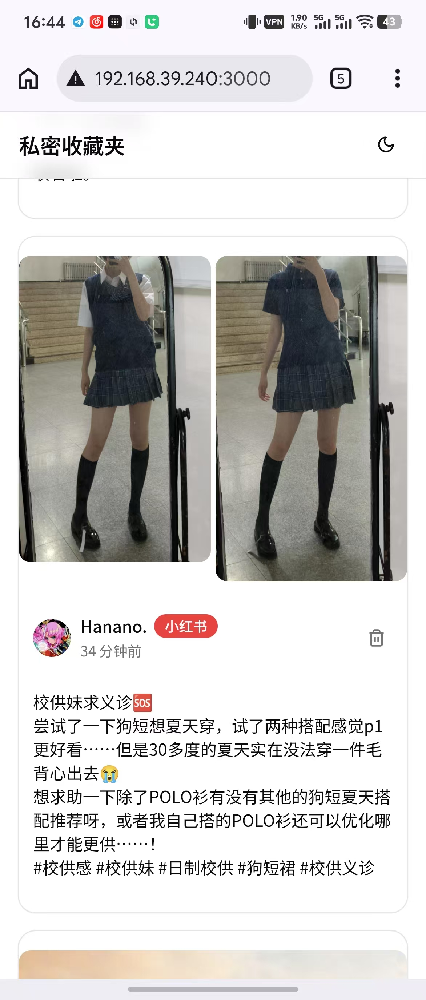

# 私密收藏夹

捕获和管理 X/Twitter、小红书、Telegram 收藏内容的私密收藏夹。无需任何第三方 API 配置，本地存储所有图片视频。

瀑布流：


大图预览：


手机端：



## 特色

- **三平台支持** — X/Twitter、小红书、Telegram（Saved Messages JSON 导入）
- **零 API 依赖** — 不需要任何官方 API key，前端贴链接即可抓取
- **自动下载** — 媒体异步下载到本地，SHA256 去重，失败自动重试
- **NSFW 模糊** — TG 来源默认模糊，逐帖切换可见，全局 NSFW 模式一键解锁
- **标签管理** — 平台标签（X / 小红书 / TG）+ 内容 hashtag 自动提取，后端维护点数
- **暗色主题** — 跟随系统或手动切换
- **移动适配** — 弹窗自适应底部弹出，键盘安全区适配

## 功能

| 功能 | 说明 |
|------|------|
| 链接抓取 | 顶部 ➕ 按钮，支持 X/小红书 URL，多条换行批量抓取 |
| TG 导入 | 设置面板 |
| 瀑布流 | CSS columns 1~4 列响应式，无限滚动 |
| 标签过滤 | 顶部标签栏，固定 X/小红书/TG + 全部 hashtag，点击后端 SQL 过滤 |
| 模糊开关 | 每个卡片右上角眼睛图标，单独切换；NSFW 模式总开关在设置面板 |
| 媒体灯箱 | 点击图片/视频全屏，ESC 关闭 |
| 软删除 | 卡片右上角删除按钮，DB 软删除并递减标签计数 |
| 暗色模式 | next-themes 跟随系统 |

## 启动

```bash
cp .env.example .env
docker compose up -d --build
```

前端 http://localhost:3000，后端 API http://localhost:8080

## 文档

- [开发环境与本地调试](docs/development.md)
- [生产部署](docs/deployment.md)
- [技术架构](docs/architecture.md)
- [TG 媒体导入](docs/tg-download-saved-media.md)
